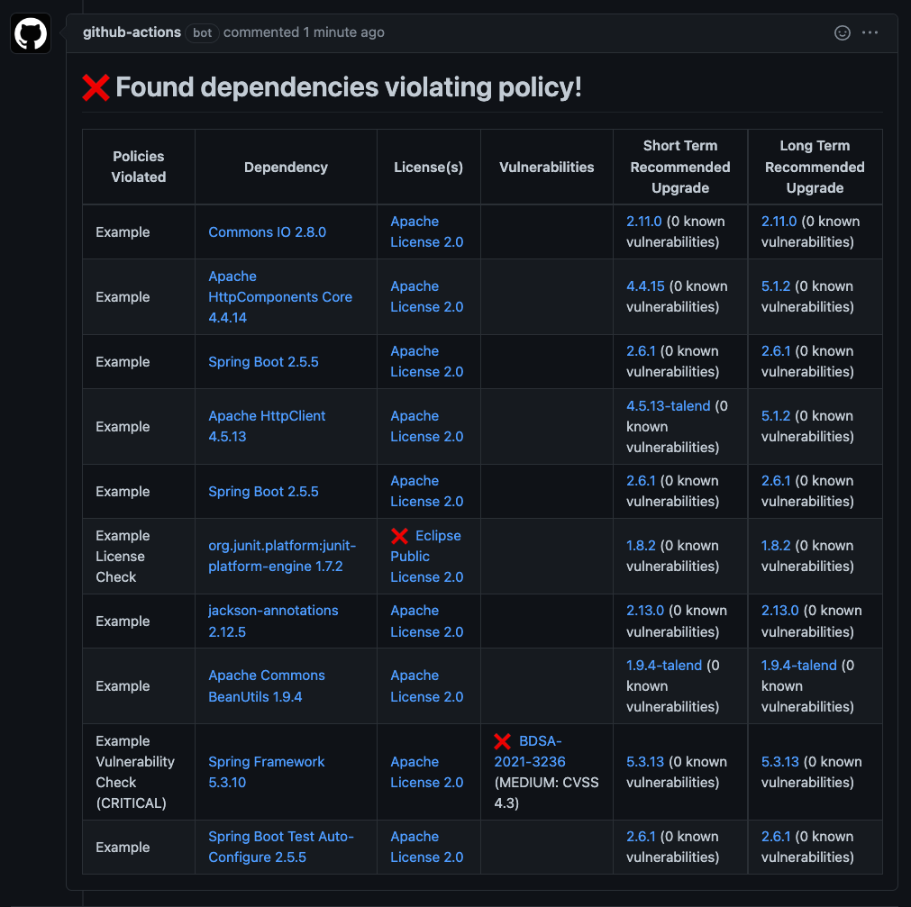
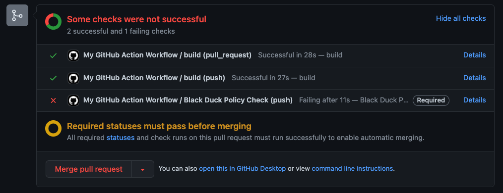

# Detect Action

(WIP)

Richly integrate Synopsys Detect into GitHub action workflows.

Configure the action to run Detect in Rapid scan mode to get detailed Black Duck policy reports (default behavior), or in Intelligent scan mode to upload your data into Black Duck for more detailed analysis.



Once your dependencies are clean, configure the action to run Detect in Rapid scan mode to protect your branches with the Black Duck Policy Check and [_Branch Protection Rules_](https://docs.github.com/en/repositories/configuring-branches-and-merges-in-your-repository/defining-the-mergeability-of-pull-requests/about-protected-branches#require-status-checks-before-merging).



# Set Up Workflow

To start using this action, you'll need to create a _job_ within a GitHub Workflow. You can either [create a new GitHub Workflow](https://docs.github.com/en/actions/learn-github-actions/workflow-syntax-for-github-actions) or use an existing one if appropriate for your use-case. 

Once you have a GitHub Workflow selected, configure which [events will trigger the workflow](https://docs.github.com/en/actions/learn-github-actions/events-that-trigger-workflows) such as _pull requests_ or _schedules_.  
**Example**:

```yaml
name: Example Workflow
on:
  pull_request:
    branches:
      - main
  schedule:
    - cron:  '0 0 * * *'
```

# Set Up Job

Once you have setup a GitHub Workflow with event triggers, you will need to create a _job_ in which the _Detect Action_ will run.  
Your job will look something like this if all configuration options are used:  

```yaml
jobs:
  security:
    runs-on: my-github-runner
    steps:
    - uses: actions/checkout@v2
    - name: Set up Java 11
      uses: actions/setup-java@v2
      with:
        java-version: '11'
        distribution: 'adopt'
    # Because this example is building a Gradle project, it needs to happen after setting up Java
    - name: Grant execute permission for gradlew to build my project
      run: chmod +x gradlew
    - name: Build my project with Gradle
      run: ./gradlew build
    - name: Create Black Duck Policy
      env:
        NODE_EXTRA_CA_CERTS: ${{ secrets.LOCAL_CA_CERT_PATH }}
      uses: blackducksoftware/create-policy-action@v0.0.1
      with:
        blackduck-url: ${{ secrets.BLACKDUCK_URL }}
        blackduck-api-token: ${{ secrets.BLACKDUCK_API_TOKEN }}
        policy-name: 'My Black Duck Policy For GitHub Actions'
        no-fail-if-policy-exists: true
    - name: Run Synopsys Detect
      uses: synopsys-sig/detect-action@v0.0.1
      env:
        NODE_EXTRA_CA_CERTS: ${{ secrets.LOCAL_CA_CERT_PATH }}
      with:
          github-token: ${{ secrets.GITHUB_TOKEN }}
          detect-version: 7.9.0
          blackduck-url: ${{ secrets.BLACKDUCK_URL }}
          blackduck-api-token: ${{ secrets.BLACKDUCK_API_TOKEN }}
```

## Runners: Self-Hosted
Using a self-hosted runner provides more flexibility in managing your build environment.

### Java
It is possible to skip the [Setup Java](#setup-java) step below if you already have Java 11 on your self-hosted runner. Ensure that the _Detect Action_ has access to the correct version of Java on its `$PATH` or within the [_GitHub Tool Cache_](https://docs.github.com/en/enterprise-server@3.0/admin/github-actions/managing-access-to-actions-from-githubcom/setting-up-the-tool-cache-on-self-hosted-runners-without-internet-access)

<h3 id="self-hosted-certs">Certificates</h3>
If your Black Duck server is on a private network, the self-hosted runner has access to that network, and the Black Duck server uses custom certificates, then you will likely need to provide a custom certificate to the _Detect Action_. 
To do this: 
1. Store the root certificate on the self-hosted runner. Example location: `/certificates/my_custom_cert.pem`
2. Set `NODE_EXTRA_CA_CERTS` in the _Detect Action's_ environment:

```yaml
    - name: Run Synopsys Detect
      uses: synopsys-sig/detect-action@v0.0.1
      env:
        NODE_EXTRA_CA_CERTS: /certificates/my_custom_cert.pem
      with:
        . . .
```
Note: The path to the certificate can be stored in a [_GitHub Secrect_](https://docs.github.com/en/actions/security-guides/encrypted-secrets).

Please reference the section [_Include Custom Certificates (Optional)_](#include-custom-certificates-optional) for more information.

### More Info
For more information on self-hosted runners, please visit [GitHub's documentation](https://docs.github.com/en/actions/hosting-your-own-runners/about-self-hosted-runners).

## Runners: GitHub-Hosted
GitHub hosted runners are convenient, but can require extra setup when managing sensitive information.

<h3 id="github-hosted-certs">Certificates</h3>
Because a GitHub-hosted runner starts with a clean file-system each run, if custom certificate files are needed, they must be created in your workflow. There are many ways to do this, two possible ways are:

**Option 1**: Download the certificate file.

**Option 2**: Store the base-64 encoded certificate in a GitHub secret, then use a workflow-step to create a _.pem_ file with that certificate's content:

```yaml
    - name: Create certificate
      run: cat <<< "${{secrets.BASE_64_CERTIFICATE_CONTENT}}" > my-cert.pem
```

The file created through one of those options can then be provided as a value for `NODE_EXTRA_CA_CERTS` in the Detect Action step:

```yaml
    - name: Run Synopsys Detect
      uses: synopsys-sig/detect-action@v0.0.1
      env:
        NODE_EXTRA_CA_CERTS: ./my-cert.pem
      with:
        . . .
```

## Checkout
Checkout the source-code onto your GitHub Runner with the following _step_:  
```yaml
    - uses: actions/checkout@v2
```

## Build Your Project
Detect is meant to be run post-build. You should add steps necessary to build your project before invoking the _Detect Action_. For example, here is how this might be done in a Gradle project:  
```yaml
    - name: Grant execute permission for gradlew
      run: chmod +x gradlew
    - name: Build with Gradle
      run: ./gradlew build
```
In the example job above, this needed to be done _after_ setting up Java because Gradle requires Java. If your project does not use Java, this step can be done before setting up Java.

## Set Up Java

Detect runs using Java 11 and the prefered distribution is from [AdoptOpenJDK](https://github.com/AdoptOpenJDK). Configure the _step_ it as follows: 
```yaml
    - name: Set up JDK 11
      uses: actions/setup-java@v2
      with:
        java-version: '11'
        distribution: 'adopt'
```

## Create Black Duck Policy (Optional)
In order to run Detect using RAPID mode (which is the default mode for the _Detect Action_), the Black Duck server Detect connects to must have at least one _policy_ and that policy must be enabled. You can create a policy within your Black Duck instance, or you can create a policy directly from your workflow using Black Duck's [_Create Policy Action_](https://github.com/blackducksoftware/create-policy-action). Note: The _Create Policy Action_ is provided for convenience and not the preferred way to manage Black Duck policies.  

The most basic usage of the action looks like this: 
```yaml
    - name: Synopsys Detect
      uses: synopsys-sig/detect-action@v0.0.1
      with:
        github-token: ${{ secrets.GITHUB_TOKEN }}
        detect-version: 7.9.0
        blackduck-url: ${{ secrets.BLACKDUCK_URL }}
        blackduck-api-token: ${{ secrets.BLACKDUCK_API_TOKEN }}
```
Please refer to [that action's documentation](https://github.com/blackducksoftware/create-policy-action) for more information on available parameters, certificate management, and troubleshooting.

## Set Up Detect Action

Once your project is checked-out, built, and Java is configured, the _Detect Action_ can be run. At minimum for Detect to run, provide:

* Black Duck URL (`blackduck-url`)
* Black Duck API Token (`blackduck-api-token`)
* Your desired Detect Version (`detect-version`) to execute
* Your _GITHUB\_TOKEN_ (`github-token`) to comment on Pull Requests or hook into GitHub Checks  (in most cases, this is `${{ secrets.GITHUB_TOKEN }}`)

### Choose your Scanning Mode

The _Detect Action_ can be configured either to monitor your commits for policy violations or upload the status of your repository to Black Duck as a project through use of the `scan-mode` option.

Set the scan mode to:

* **RAPID** (default) if you want to enable the Black Duck policy check and comments on your pull requests
* **INTELLIGENT** if you want to execute a full analysis of Detect and upload your results into a project in Black Duck.

These modes also have implications for how Detect is run. RAPID will not persist the results and disables select Detect functionality for faster results. INTELLIGENT persists the results and permits all features of Detect.

See also: [Detect Documentation of Rapid Scan](https://community.synopsys.com/s/document-item?bundleId=integrations-detect&topicId=downloadingandrunning%2Frapidscan.html&_LANG=enus)

### Additional Action Parameters

 - `output-path-override`: Override for where to output Detect files
   - Default: $RUNNER_TEMP/blackduck/

### Additional Detect Properties

Passing additional [Detect properties](https://community.synopsys.com/s/document-item?bundleId=integrations-detect&topicId=properties%2Fall-properties.html&_LANG=enus) can be done in several ways:
1. Use individual environment variables 

**Example**:
```yaml
    - name: Synopsys Detect
      uses: synopsys-sig/detect-action@v0.0.1
      env:
        DETECT_TOOLS: DOCKER
        DETECT_DOCKER_IMAGE_ID: abc123
        DETECT_DOCKER_PATH_REQUIRED: TRUE
      with:
        . . .
```
2. Use the `SPRING_APPLICATION_JSON` environment variable 

**Example**:
```yaml
    - name: Synopsys Detect
      uses: synopsys-sig/detect-action@v0.0.1
      env:
        SPRING_APPLICATION_JSON: '{"detect.tools":"DOCKER","detect.docker.image.id":"abc123","detect.docker.path.required":"TRUE"}'
      with:
        . . .
```
3. Expose an _application.properties_ or _application.yml_ file in your repository's root directory, or in a _config_ subdirectory

Please refer to the [Detect documentation on this topic](https://community.synopsys.com/s/document-item?bundleId=integrations-detect&topicId=configuring%2Fothermethods.html&_LANG=enus) for more information.

### Detect Diagnostic Zip

When passing the properties DETECT_DIAGNOSTIC_MODE or DETECT_DIAGNOSTIC_EXTENDED as environment variables, the action will helpfully upload the zip as a build artifact for convenient troubleshooting.

## Include Custom Certificates (Optional)

To include one or more certificates, set `NODE_EXTRA_CA_CERTS` to the certificate file-path(s) in the environment. 
Notes: 

- The certificate(s) must be in _pem_ format. 
- This environment variable can also be used with the _Create Policy Action_.  

**Example**:   
```yaml
- name: Synopsys Detect
        uses: synopsys-sig/detect-action@main
        env:
            NODE_EXTRA_CA_CERTS: ${{ secrets.LOCAL_CA_CERT_PATH }}
        with:
            . . .
```
### Troubleshooting Certificates
- Problem: An error saying the file-path to the certificate cannot be read.
  - Solution: Ensure whitespace and other special characers are properly escaped based on your runner's OS.
- Problem: An error about missing certificates in the certificate-chain or missing root certificates.
  - Solution: You may only be including the server's certificate and not the _root CA certificate_. Ensure you are using the _root CA certificate_.

# Policy Checks

When the _Detect Action_ runs in RAPID mode, it creates a 'Black Duck Policy Check'. This check can be used within [_Branch Protection Rules_](https://docs.github.com/en/repositories/configuring-branches-and-merges-in-your-repository/defining-the-mergeability-of-pull-requests/about-protected-branches#require-status-checks-before-merging) to prevent merging Pull Requests that would introduce Black Duck Policy Violations.